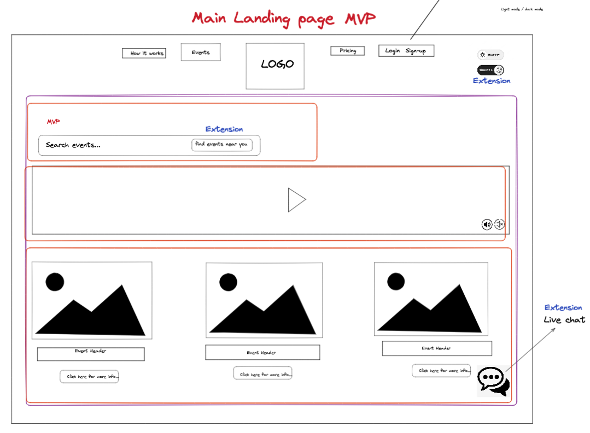
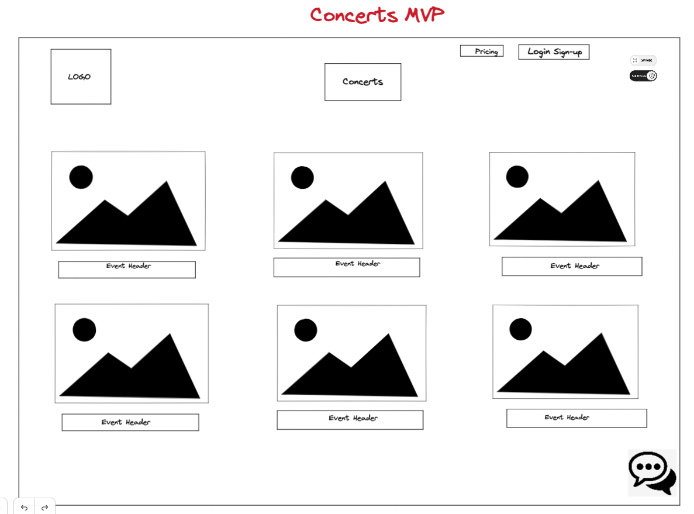
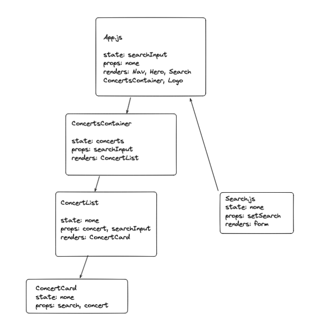

<div align="center">
    
    <h1>SoundStage: Getting you straight to the stage</h1>
</div>


## Project Description
SoundStage allows users to view a range of concerts fetched from an API. Users can filter concerts by artist name and sort the list of concerts by ticket price and venue capacity. A user can also log in, so long as they have an account existing in the database. 

Technologies used:

| Technology  | Version |
|-------------|---------|
| Node        | 18.11   |

This app works directly with the Track 2 Backend Concert API, which can be found [here](https://github.com/caitlinmillar/Backend_Concert). Follow their set up instructions before you get started installing SoundStage.

---
## Installation Instructions

Follow these steps to get started with the SoundStage app:

1. If you have HomeBrew installed, use the following line to install Node. This includes npm:
```
$ brew install node
```
Otherwise, install it from [here](https://nodejs.org/en/download/)

2. To access this application, you can clone this repository using the terminal on your system using:
```
$ git clone https://github.com/wjstanistreet/SoundStage.git
```

3. Within the newly cloned repository, install the default Node modules using:
```
$ npm i
```

4. You will also need to install React Router, using:
```
$ npm install react-router-dom@6
```

5. To get the web app running, use:
```
$ npm start
```
SoundStage should now be open in your default browser!

---

## Project Aims

- The website has a landing page, a page describing how purchasing a ticket would work, and a concerts page showing a list of available concerts. 
- Users can filter concerts by artist name, sort the list of concerts by ticket price and venue capacity, and select all luxury concerts (where the ticket price is > 150).
- A user can also log in with their username, so long as they have an account existing in the database. A rejection notice will show if the username is invalid and not in the database.

Here is the initial wireframe and components diagram that was used to plan the design for the website:

<div>
    
    
    
</div>

---

## Extensions

- Allow someone to create a user account and have it save in the database.
- Allow users to add and remove themselves to and from concerts and have it save in the database. 